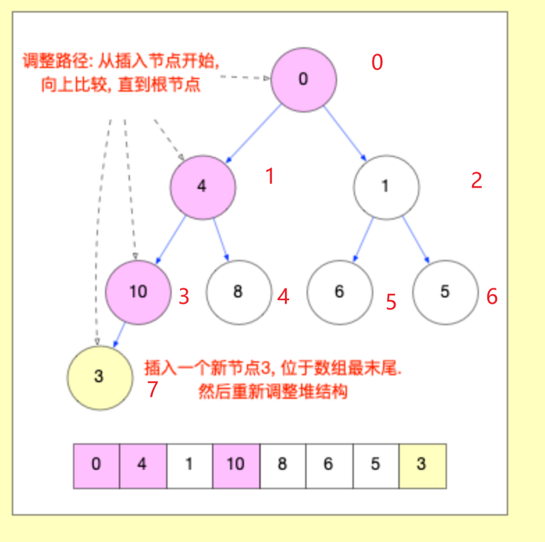
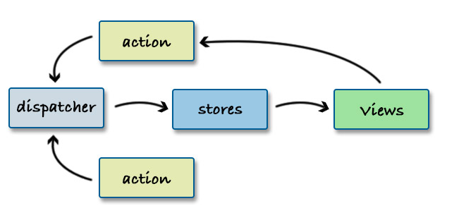

<!--
 * @Author: xiaohu
 * @Date: 2024-02-29 14:27:26
 * @LastEditors: yeyu98
 * @LastEditTime: 2024-06-20 10:54:32
 * @FilePath: \interview-handwrite\README.md
 * @Description: 
-->
# interview-handwrite

- [防抖/节流](./src/debounce-throttle.js)
- [并发请求数量控制](./src/limit-request.js)
- [LazyMan](./src/lazy-man.js)
- [Promise](./src/promise.js)
- [Promise.all](./src/promise-all.js)
- [观察者模式](./src/observer.js)
- [发布订阅模式](./src/pubsub.js)
- [数组转树](./src/listToTree.js)
- [小顶堆](./src/min-heap.js)
  
- [准时setTimeout](./src/setTimeout.js)
- [Redux](./src/flux.js)
  